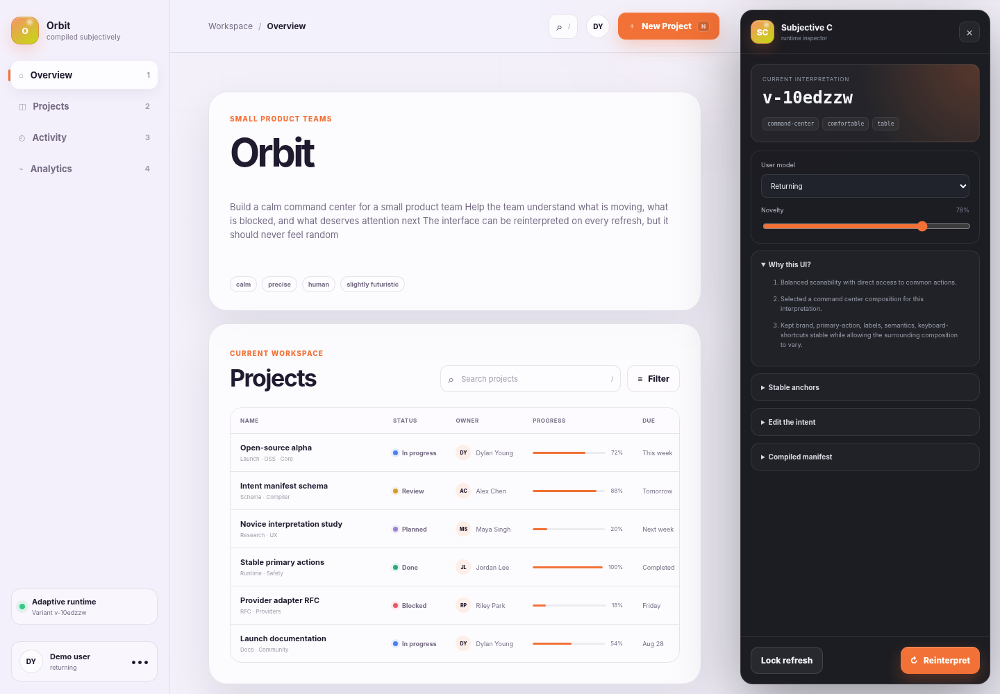
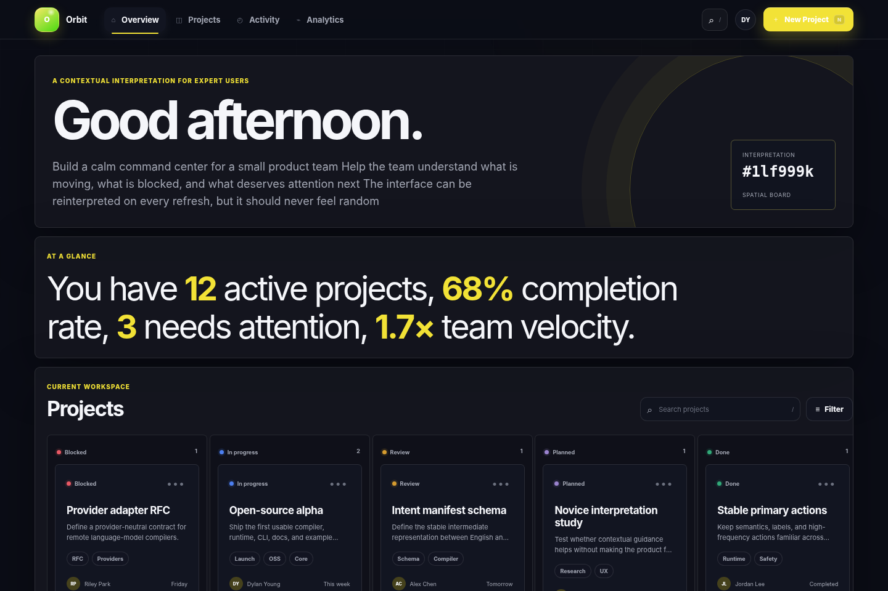
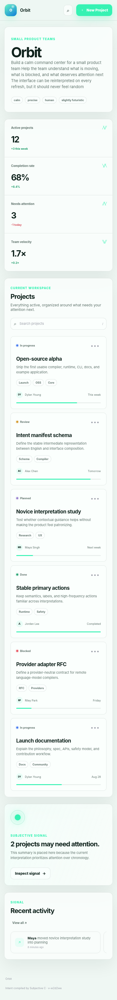

# Subjective C

> **Intent in. Interface out.**

Subjective C is an experimental, open-source framework for building interfaces from product intent instead of fixed pixels. You describe what the product should accomplish, what must stay familiar, what should adapt, and how it should feel. The compiler turns that English into an inspectable manifest. The runtime then creates a constrained UI interpretation for the current user and context.

It is not random UI generation. It is **bounded variation with stable semantics**. The “C” is the compiler between human intent and a valid interface interpretation.



## The idea

Traditional frontend code says:

```text
Put this 40px button here. Use this grid. Keep this panel on the left.
```

Subjective C says:

```subjective
# Orbit

Build a calm command center for a small product team.

## Must
- Make creating a project obvious
- Keep search available
- Preserve the wording of important actions

## Adapt
- New users should see more guidance
- Power users should get denser information

## Avoid
- Decorative variation that hurts accessibility
```

That source compiles into a stable intent manifest. A policy engine then chooses a layout, density, component forms, copy style, and visual treatment while preserving required actions, labels, semantics, keyboard shortcuts, and accessibility constraints.

## What is included in 0.2 alpha

- A dependency-free English-to-manifest compiler
- A deterministic seeded variation engine
- Six layout families and four collection representations
- Novice, returning, expert, mobile, contrast, and motion contexts
- Stable anchors for brand, actions, labels, semantics, and shortcuts
- Trusted component and permission-aware action contracts
- Application-owned component packages and validated theme-token contracts
- A serializable plan that proves required capabilities remain reachable
- Stable context assignments by default, with explicit reinterpretation
- A browser runtime with generated navigation, metrics, collections, activity, search, dialogs, and semantic action events
- An in-browser inspector that can edit and recompile the source
- Persisted density, motion, and contrast preferences that survive reinterpretation
- Runtime permission authorization and destructive-action confirmation gates
- Structured manifest, registry, permission, and plan diagnostics
- A CLI with `init`, `dev`, `build`, `inspect`, and `doctor`
- Atomic static builds with guarded output paths and no framework runtime dependency
- A provider API for replacing the local compiler with an external model
- Unit, semantic, security, browser, accessibility, package-budget, and benchmark gates
- JSON schemas, RFCs, contribution files, and a reference application

Subjective C uses a local heuristic compiler by default, so the repository works without an API key or network request. The provider interface is where more capable compilers can plug in.

## Run the reference app

```bash
git clone https://github.com/samforrester/subjective-c.git
cd subjective-c
npm ci
npm run dev
```

Open the URL printed by the CLI. The inspector lets you change the English source, user model, and novelty level in real time.

Build the static app:

```bash
npm run build
```

Inspect the compiler output without starting a browser:

```bash
npm run inspect
```

Run every test and produce the reference build:

```bash
npm run check
```

Run the complete alpha release gate (after `npm run browser:install` locally):

```bash
npm run release:check
```

## Create an app

From this monorepo:

```bash
node packages/cli/bin/subjective.js init ../my-subjective-app
```

Once the packages are published, the intended flow is:

```bash
npm create subjective-c@latest my-app
cd my-app
npm install
npm run dev
```

A Subjective C app is deliberately small:

```text
my-app/
├── app.subjective
├── subjective.config.js
└── package.json
```

## Architecture

```text
app.subjective
      │
      ▼
┌──────────────────────┐
│ compiler / provider  │  English → intent manifest
└──────────┬───────────┘
           │
           ▼
┌──────────────────────┐
│ policy + variant     │  manifest + context + stable seed → interpretation
│ engine               │
└──────────┬───────────┘
           │
           ▼
┌──────────────────────┐
│ trusted planner      │  interpretation + registry → verified plan
└──────────┬───────────┘
           │
           ▼
┌──────────────────────┐
│ browser runtime      │  verified plan + data → semantic UI
└──────────┬───────────┘
           │
           ▼
   subjective:action      generated UI → application behavior
```

The important boundary is the manifest. A compiler may be heuristic, model-backed, human-authored, or domain-specific. The runtime does not care as long as the manifest validates.

## Stable versus subjective

Subjective C separates the interface into two categories.

**Stable anchors** protect muscle memory and trust:

- Brand identity and product name
- Primary action semantics and wording
- Navigation labels and domain terminology
- Keyboard shortcuts
- Accessibility and contrast requirements
- Destructive-action safety

**Subjective composition** may change:

- Card, row, table, or board representation
- Information density
- Section order within policy limits
- Guidance and copy length
- Navigation orientation
- Visual rhythm, radius, palette, and motion

The long-term goal is not “a new UI every refresh.” The goal is an interface that can select the best valid interpretation for a person, task, device, and moment.

### One source, different contexts

 

Both screenshots were compiled from the same `app.subjective` file. The expert context receives a dense spatial board; the mobile novice context receives a guided vertical flow. The product semantics and primary action remain stable.

## CLI

| Command | Purpose |
| --- | --- |
| `subjective init [dir]` | Scaffold a new app |
| `subjective dev [dir]` | Compile, serve, watch, and live reload |
| `subjective build [dir]` | Emit a static app to `dist/` |
| `subjective inspect [file]` | Print the manifest and sample interpretations |
| `subjective doctor [dir]` | Verify the local setup |

## Packages

| Package | Responsibility |
| --- | --- |
| `@subjective-c/core` | Parsing, validation, providers, variants, component/action contracts, verified plans |
| `@subjective-c/runtime` | Browser rendering, interaction, devtools, semantic action events |
| `subjective-c` | CLI, static builds, dev server, project scaffolding |
| `create-subjective-c` | `npm create` application bootstrapper |

## Semantic actions

Generated composition must not own business logic. The browser runtime emits a bubbling event whenever a generated control is used:

```js
window.addEventListener("subjective:action", (event) => {
  const { id, kind, variant, permission, destructive, confirmation } = event.detail;
  // Route the semantic action into your domain layer.
});
```

Permissioned actions do not emit this event unless the host's `authorizeAction` callback returns `true`. Destructive actions must also pass either the host's `confirmAction` callback or the runtime's accessible confirmation dialog. Authorization must still be repeated in the service that performs the mutation.

Runtime preferences and application theme tokens are explicit inputs:

```js
mountSubjective(target, {
  manifest,
  variant,
  plan,
  preferences: { density: "compact", motion: "reduced" },
  themeTokens: { accent: "#4422aa", "header-height": "72px" },
  callbacks: {
    authorizeAction: ({ permission }) => session.permissions.includes(permission),
    onPreferenceChange: (preferences) => preferenceStore.save(preferences)
  }
});
```

This keeps “what the action means” stable even when “how the action is presented” changes.

## Provider API

The default compiler is local and deterministic. A provider can replace it:

```js
export default {
  provider: {
    name: "my-compiler",
    async compile(source, options) {
      const manifest = await compileWithYourModel(source, options);
      return manifest;
    }
  },
  providerFallback: true
};
```

Provider output is validated before planning or rendering. If the provider fails and fallback is enabled, the local compiler produces the build instead.

See [`docs/COMPONENT_CONTRACTS.md`](docs/COMPONENT_CONTRACTS.md) for the trusted registry and action model and [`docs/SECURITY_MODEL.md`](docs/SECURITY_MODEL.md) for the current safety boundary.

## Status

This is an alpha and a serious prototype, not a production recommendation. The current compiler understands structured English and common product vocabulary; it does not yet reason deeply about arbitrary domains. The alpha now enforces plan reachability, trusted component/action packages, fail-closed client authorization, destructive confirmation, safe preferences and tokens, output-path safety, provider validation, deterministic assignments, and automated accessibility checks. Production use still needs framework adapters, service-side policy integration, telemetry and privacy design, independent security review, and user research on trust and muscle memory.

Read [`docs/ROADMAP.md`](docs/ROADMAP.md) for the path forward and [`docs/RFC-0001-INTENT-FIRST-UI.md`](docs/RFC-0001-INTENT-FIRST-UI.md) for the original technical proposal.

## Contributing

Start with [`CONTRIBUTING.md`](CONTRIBUTING.md), then open an issue or RFC before making a large architectural change. The project is intentionally provider-neutral and application-framework-neutral.

## License

MIT.
